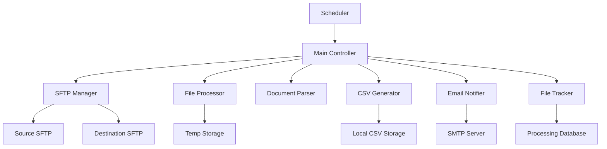

# Medical Document Processing System - Design Document

## Overview

The Medical Document Processing System is a Python application that automates the extraction and processing of medical documents from SFTP servers. The system uses a modular architecture with clear separation of concerns, robust error handling, and flexible scheduling capabilities.

## Architecture

The system follows a layered architecture pattern with the following main components:



### Core Components

1. **Main Controller**: Orchestrates the entire processing workflow
2. **Scheduler**: Handles both interval and cron-based scheduling
3. **SFTP Manager**: Manages connections and file operations with SFTP servers
4. **File Processor**: Handles ZIP file extraction and temporary file management
5. **Document Parser**: Extracts text and medical fields from .doc/.docx files
6. **CSV Generator**: Creates standardized CSV reports from parsed data
7. **Email Notifier**: Sends success summaries and failure alerts
8. **File Tracker**: Maintains processing history and file modification tracking

## Components and Interfaces

### 1. Configuration Manager
```python
class ConfigManager:
    def load_config() -> Dict[str, Any]
    def validate_required_config() -> bool
    def get_sftp_config(server_type: str) -> SFTPConfig
    def get_email_config() -> EmailConfig
    def get_schedule_config() -> ScheduleConfig
```

### 2. SFTP Manager
```python
class SFTPManager:
    def connect(config: SFTPConfig) -> paramiko.SFTPClient
    def list_zip_files(client: SFTPClient) -> List[FileInfo]
    def download_file(client: SFTPClient, remote_path: str, local_path: str) -> bool
    def upload_file(client: SFTPClient, local_path: str, remote_path: str) -> bool
    def get_file_mtime(client: SFTPClient, remote_path: str) -> datetime
```

### 3. Document Parser
```python
class DocumentParser:
    def extract_text_from_doc(file_path: str) -> str
    def extract_text_from_docx(file_path: str) -> str
    def parse_medical_fields(text: str) -> MedicalRecord
    def normalize_date(date_str: str) -> str
```

### 4. File Tracker
```python
class FileTracker:
    def is_file_processed(filename: str, mtime: datetime) -> bool
    def mark_file_processed(filename: str, mtime: datetime) -> None
    def get_processing_history() -> List[ProcessingRecord]
```

### 5. Scheduler
```python
class Scheduler:
    def setup_interval_schedule(interval_seconds: int) -> None
    def setup_cron_schedule(cron_expression: str, timezone: str) -> None
    def start() -> None
    def stop() -> None
```

## Data Models

### MedicalRecord
```python
@dataclass
class MedicalRecord:
    source_file: str
    first_name: str = ""
    last_name: str = ""
    date_of_birth: str = ""
    record_number: str = ""
    case_number: str = ""
    accident_date: str = ""
    provider_first: str = ""
    provider_last: str = ""
    exam_date: str = ""
    exam_place: str = ""
    transcriptionist: str = ""
    dd_date: str = ""
    transcription_date: str = ""
    job_number: str = ""
    case_code: str = ""
```

### ProcessingResult
```python
@dataclass
class ProcessingResult:
    zip_filename: str
    total_documents: int
    successful_extractions: int
    failed_extractions: int
    csv_filename: str
    processing_time: float
    errors: List[str]
```

### SFTPConfig
```python
@dataclass
class SFTPConfig:
    host: str
    port: int
    username: str
    password: str
    remote_path: str
```

## Error Handling

### Error Categories
1. **Configuration Errors**: Missing or invalid environment variables
2. **SFTP Connection Errors**: Network issues, authentication failures
3. **File Processing Errors**: Corrupt ZIP files, unsupported document formats
4. **Document Parsing Errors**: Malformed documents, missing medical fields
5. **Email Notification Errors**: SMTP connection issues

### Error Handling Strategy
- **Fail Fast**: Configuration errors stop the application immediately
- **Graceful Degradation**: Individual document failures don't stop batch processing
- **Immediate Notification**: Any extraction failure triggers immediate admin email
- **Comprehensive Logging**: All errors logged with context and timestamps
- **Retry Logic**: Transient SFTP errors include retry mechanisms

### Error Recovery
```python
class ErrorHandler:
    def handle_sftp_error(error: Exception, operation: str) -> bool
    def handle_document_error(error: Exception, filename: str) -> None
    def handle_email_error(error: Exception) -> None
    def log_error(error: Exception, context: Dict[str, Any]) -> None
```

## Testing Strategy

### Unit Testing
- **Configuration Manager**: Test environment variable loading and validation
- **Document Parser**: Test field extraction with sample medical documents
- **File Tracker**: Test processing history and duplicate detection
- **CSV Generator**: Test CSV format and field ordering
- **Date Normalization**: Test various date formats and edge cases

### Integration Testing
- **SFTP Operations**: Test with mock SFTP servers
- **Email Notifications**: Test with mock SMTP servers
- **End-to-End Workflow**: Test complete processing pipeline with sample data

### Test Data
- Sample medical documents with various formats and field arrangements
- ZIP files with mixed document types and structures
- Edge cases: empty documents, malformed dates, missing fields

## Security Considerations

### Credential Management
- All sensitive data stored in environment variables
- No hardcoded credentials in source code
- Support for .env files for development environments

### File Handling
- Temporary files cleaned after processing
- Secure file permissions on local storage
- ZIP extraction with path traversal protection

### Network Security
- SFTP connections with proper authentication
- Email transmission with TLS encryption
- Connection timeout and retry limits

## Performance Considerations

### Memory Management
- Stream processing for large ZIP files
- Temporary file cleanup after each document
- Batch processing with configurable limits

### Concurrency
- Single-threaded processing to avoid SFTP connection conflicts
- Asynchronous email notifications
- Non-blocking scheduler implementation

### Storage Management
- 60-day retention policy for processed CSV files
- Automatic cleanup of expired files
- Configurable storage paths

## Deployment Architecture

### Environment Variables
```
# SFTP Configuration
SOURCE_SFTP_HOST=source.example.com
SOURCE_SFTP_PORT=22
SOURCE_SFTP_USERNAME=user
SOURCE_SFTP_PASSWORD=pass
SOURCE_SFTP_PATH=/incoming

DEST_SFTP_HOST=dest.example.com
DEST_SFTP_PORT=22
DEST_SFTP_USERNAME=user
DEST_SFTP_PASSWORD=pass
DEST_SFTP_PATH=/processed

# Email Configuration
SMTP_HOST=smtp.example.com
SMTP_PORT=587
SMTP_USERNAME=notify@example.com
SMTP_PASSWORD=pass
ADMIN_EMAIL=admin@example.com

# Scheduling
POLL_INTERVAL_SECONDS=60
POLL_CRON=0 2 * * *
TZ=America/New_York

# Storage
LOCAL_STORAGE_PATH=/app/data
TEMP_PATH=/app/temp
```

### Directory Structure
```
medical-document-processor/
├── src/
│   ├── main.py
│   ├── config/
│   │   └── settings.py
│   ├── sftp/
│   │   └── manager.py
│   ├── parser/
│   │   └── document_parser.py
│   ├── scheduler/
│   │   └── job_scheduler.py
│   ├── email/
│   │   └── notifier.py
│   └── utils/
│       ├── file_tracker.py
│       └── csv_generator.py
├── tests/
├── requirements.txt
├── .env.example
└── README.md
```

## Logging and Monitoring

### Log Levels
- **INFO**: Normal processing events, file counts, timing
- **WARNING**: Recoverable errors, retry attempts
- **ERROR**: Processing failures, configuration issues
- **DEBUG**: Detailed processing steps, field extraction details

### Log Format
```
[TIMESTAMP] [LEVEL] [COMPONENT] - MESSAGE
[2024-01-15 14:30:15] [INFO] [SFTPManager] - Connected to source SFTP server
[2024-01-15 14:30:16] [ERROR] [DocumentParser] - Failed to extract fields from report_001.docx: Missing date_of_birth field
```

### Monitoring Metrics
- Files processed per run
- Processing success/failure rates
- Average processing time per document
- SFTP connection health
- Email notification delivery status